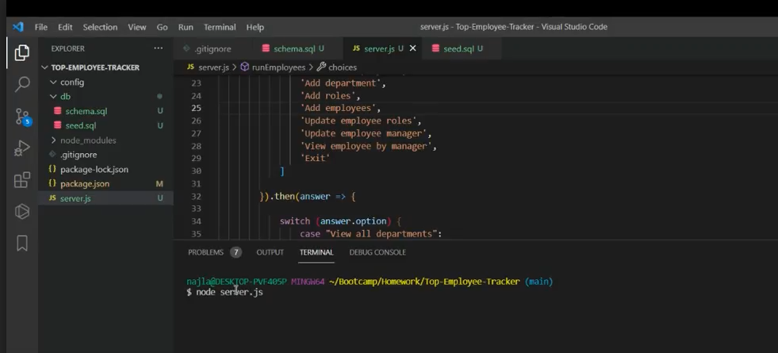
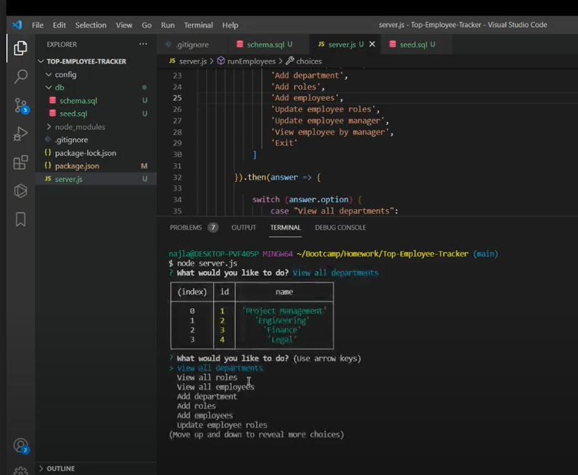
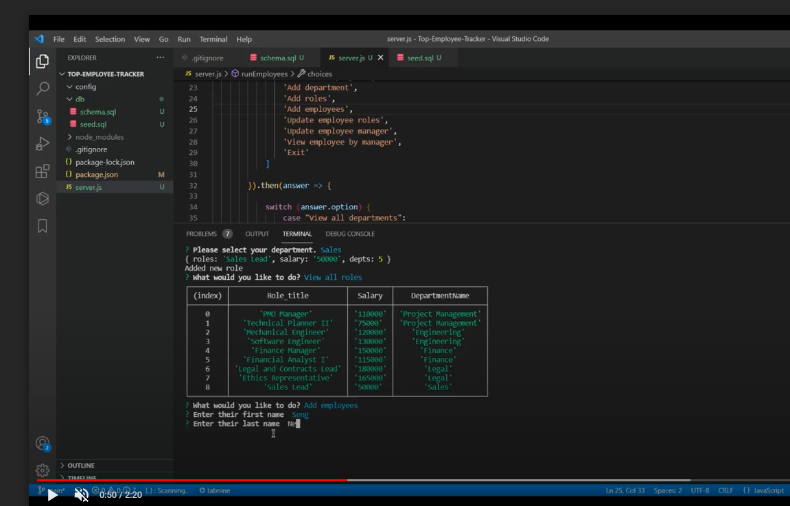
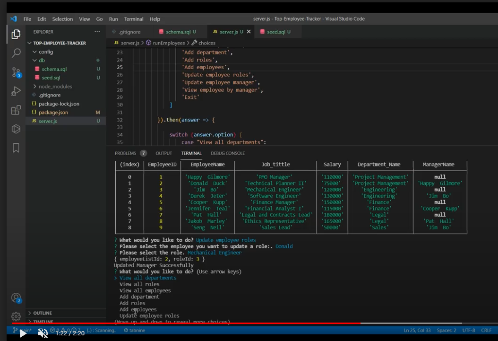

[![Contributors][contributors-shield]][contributors-url]
[![MIT License][license-shield]][license-url]

# Top Employee Tracker
<div>
   <p>
    View application functionality.<a href="https://drive.google.com/file/d/1PO7IP4yyhgUADwFYL9OrVbwM0ZUj7TeF/view"> Walkthrough Video</a><br>
      
  </p>
</div>

## Table of Contents
* [Description](#description)
* [Usage](#usage)
* [Tests](#tests)
* [Built With](#built-with)
* [License](#license)
* [Credits](#credits)
* [Questions](#questions)

## Description: 
This is a command line application to view and interact with information stored in databases. This application is a solution for managing a company's employees using node, inquirer, and MySQL2. Employee Tracker allows managers or someone within the company to view all employees, roles, as well as departments. It also allows for adding employees, roles, departments and updating employees all from your CLI.


<br>
<br>

<br>
<br>

<br>
<br>

<br>
<br>

<p align="right">(<a href="#top">back to top</a>)</p>

### Before attempting to use this project, install the following on your computer:
* VS Code
* GitBash
* Node.js

## Usage

1. Clone my repository to use this application on your local machine.
2. To install dependencies run the command "npm i" or "npm install" to install dependency packages needed
3. The application will be invoked by using the following command:

```bash
node server.js
```

## Tests
* N/A for this application

<p align="right">(<a href="#top">back to top</a>)</p>

## Built With
- [Node.js](https://nodejs.org/en/)
- [Express.js](https://en.wikipedia.org/wiki/Express.js)
- [Javascript](https://www.javascript.com)
- [mysql2](https://www.npmjs.com/package/mysql2)

## Project Link

[Portfolio Repository](https://github.com/nparker80/top-employee-tracker)

## License 
This project is licensed under MIT

## Credits

List of Contributors:

1. Najla Parker - Node, Express, Javascript, mysql2

## Questions

Najla Parker - najla08@me.com [![LinkedIn][linkedin-shield]][linkedin-url-naj] [![GitHub][github-shield]][github-url-naj]

<p align="right">(<a href="#top">back to top</a>)</p>

<!-- MARKDOWN LINKS & IMAGES -->
<!-- https://www.markdownguide.org/basic-syntax/#reference-style-links -->

[contributors-shield]: https://img.shields.io/github/contributors/nparker80/readme-generator.svg?style=for-the-badge
[contributors-url]: https://github.com/nparker80/readme-generator/graphs/contributors
[license-shield]: https://img.shields.io/github/license/nparker80/readme-generator
[license-url]: https://github.com/nparker80/readme-generator/blob/main/LICENSE
[linkedin-shield]: https://img.shields.io/badge/-LinkedIn-black.svg?style=for-the-badge&logo=linkedin&colorB=555
[linkedin-url-naj]: https://www.linkedin.com/in/najlaparker/
[github-shield]: https://img.shields.io/badge/-Github-blueviolet.svg?style=for-the-badge&logo=Github&colorB=555
[github-url-naj]: https://github.com/nparker80
